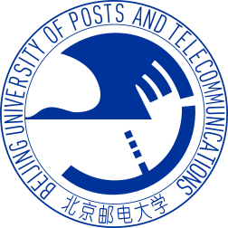

## About Me

Hi, I am Xuyuan Guo and I'm currently an undergraduate student major in Computer Science and Technology, Beijing University of Posts and Telecommunications.

My research interest includes **Natural Language Processing** and **Software Engineering**. Please feel free to contact me via email for any opportunities or collaborations.  

## Projects

<table style="margin-top: 0em;" width="100%" align="center" border="0" cellpadding="5">
  <tbody>
    <tr>
      <td valign="middle">
        <papertitle><strong>Business Hall Time Management and Allocation System</strong></papertitle>
        <small><a href="https://github.com/XuyuanGuo/office-management">[Project Page]</a></small>
        

            
A Practice of Full-Stack Development
	
        

        
This project aims to use the BS architecture pattern to provide a business hours management system for business halls in different regions, requiring the ability to set the working hours for each business hall on weekdays and holidays. Later, this system will be used to manage the time for conducting intelligent video analysis in the business halls.

      </td>
    </tr>
  </tbody>
</table>

<table style="margin-top: 0em;" width="100%" align="center" border="0" cellpadding="5">
  <tbody>
    <tr>
      <td valign="middle">
        <papertitle><strong>Text Subject Classification Using SVM</strong></papertitle>
        <small><a href="https://github.com/XuyuanGuo/bupt_AI-Principle">[Project Page]</a></small>
        

            
Fianl project for Principles of Artificial Intelligence, 2023 Fall, BUPT
	
        

        
In this project, I selected documents from 10 categories (Home, Games, Finance, Sports, Technology, Entertainment, Stocks, Politics, Society, Education) from the THUCNews dataset, dividing them into training and test sets in a 1:1 ratio. The training set includes 395,747 documents,and the test set also contains 395,747 documents. I then used SVM to classify the documents by their thematic categories.

      </td>
    </tr>
  </tbody>
</table>

<table style="margin-top: 0em;" width="100%" align="center" border="0" cellpadding="5">
  <tbody>
    <tr>
      <td valign="middle">
        <papertitle><strong>DNS relay server</strong></papertitle>
        <small><a href="https://github.com/XuyuanGuo/bupt_Computer-Networks">[Project Page]</a></small>
        

            
Fianl project for Curriculum Practice of Computer Networks, 2023 Spring, BUPT
	
        

        
In this project, I wrote a DNS relay server using C/C++ to manage DNS requests within a local network. The server provides the following features: request forwarding, caching of query results, blocking of malicious domain names, load balancing, and failover capabilities.

      </td>
    </tr>
  </tbody>
</table>

## Experience

<table style="margin-top: 0em;" width="100%" align="center" border="0" cellpadding="5">
  <tbody>
    <tr>
      <td width="75%" valign="middle">
        <papertitle><strong>Lenovo Research</strong></papertitle>
        

            
 Data Analyst Intern
              Oct 2024 - Present  
            
	
        

        
I started my internship at Lenovo Research as a Data Analyst in October 2024.

        </td>
        <td align="center" style="padding:2px 10px;width:25%;text-align:center;vertical-align:middle">
      </td>
    </tr>
  </tbody>
</table>

## Honors and Awards

- 2023.12 **Muse Technologies Scholarship**, Beijing University of Posts and Telecommunications
- 2023.12 **Merit Student**, Beijing University of Posts and Telecommunications
- 2022.12 **First-class Scholarship(Top 3%)**, Beijing University of Posts and Telecommunications
- 2022.12 **Merit Student**, Beijing University of Posts and Telecommunications
- 2022.11 Unofficial participant and achieved a **Bronze Medal** ranking, [The 47th ICPC Asia Regional Programming Contest Hefei](https://board.xcpcio.com/icpc/47th/hefei?group=all)

## Education

<table style="margin-top: 0em;" width="100%" align="center" border="0" cellpadding="5">
  <tbody>
    <tr>
      <td width="75%" valign="middle">
        <papertitle><strong>National University of Singapore</strong></papertitle>
        

            
 Artificial Intelligence and Machine Learning Programme
              Jan 2023 - Feb 2023  
            
	
        

        <ul>
            <li style="margin-top: 0.3em">
              Overall Grade: DISTINCTION
            </li>
        </ul>
        </td>
        <td align="center" style="padding:2px 10px;width:25%;text-align:center;vertical-align:middle">
      </td>
    </tr>
  </tbody>
</table>

<table style="margin-top: 0em;" width="100%" align="center" border="0" cellpadding="5">
  <tbody>
    <tr>
      <td width="75%" valign="middle">
        <papertitle><strong>Beijing University of Posts and Telecommunications</strong></papertitle>
        

            
 BEng Computer Science and Technology
              Sept 2021 - Present  
            
	
        

        <ul>
            <li style="margin-top: 0.3em">
              GPA: 3.8/4.0
            </li>
            <li style="margin-top: 0.3em">
              Ranking: Top 5% in the department
            </li>
        </ul>
        </td>
        <td align="center" style="padding:2px 10px;width:25%;text-align:center;vertical-align:middle">
      </td>
    </tr>
  </tbody>
</table>
